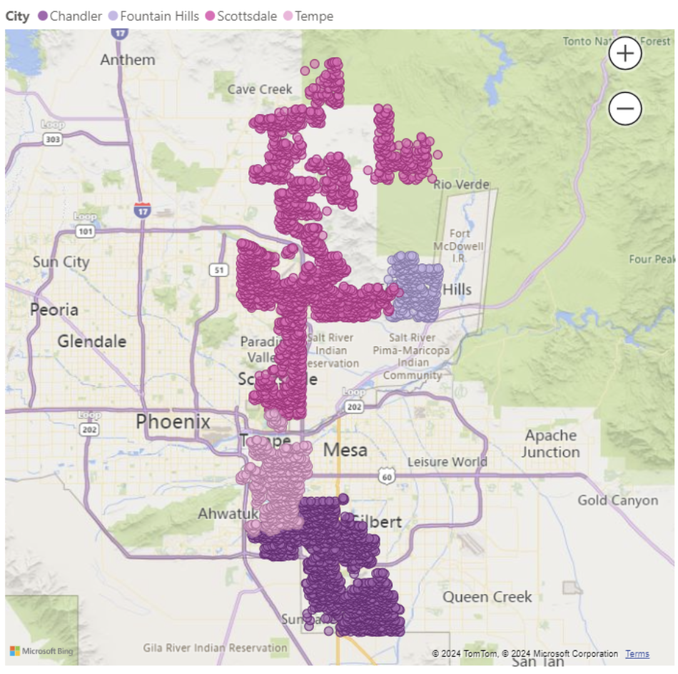
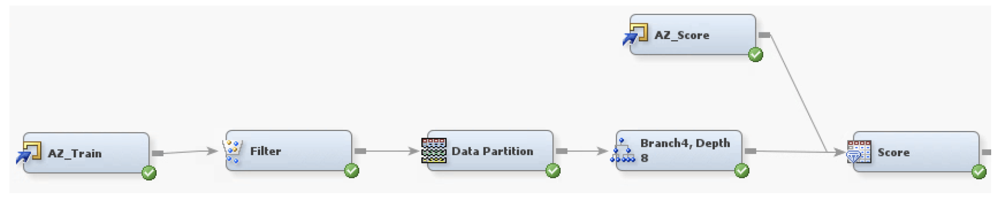
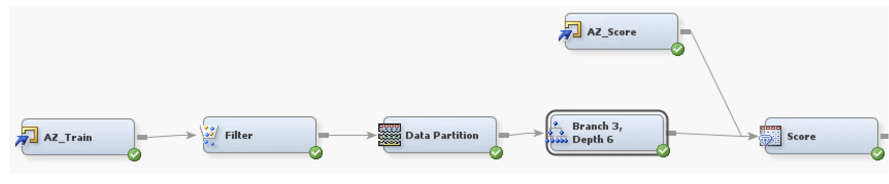

  

## Housing Data Project
---

The goal of the assignment was to create a predictive model in SAS Miner that could accurately predict the housing prices for three cities in Arizona. Specifically, the goal was 
to estimate home prices in Chandler, Scottsdale, Fountain Hills, and Tempe. 

  

---

## Data Exploration and Cleaning 🧭
---
The data consisted of one Excel workbook with 92 columns and 17,467 rows. The project started with data cleaning and exploration in Excel before the data was uploaded into SAS Miner. 
One of the primary goals of the data cleaning phase was to reduce the total number of columns being used in the data.  This reduction was based on several criteria designed to enhance 
the dataset's utility for modeling:

* **Unary Variables**: Columns exhibiting no variability (i.e., unary variables) were removed, as they offer no informational value for predictive modeling or analysis. Example: column
   Property Type had only the entry "Residential" and column Status only had "C" as entries, and were filtered out of the data.
* **Missing Values**: Columns with a high percentage of missing values were also eliminated. This step was crucial for maintaining the statistical integrity of the model, as
  excessive missing data can lead to biased or inaccurate results. Example: Building_Number column only had one entry and End_Date only had two entries, both were filtered out.
* **Relevancy**: Finally,the relevancy of each variable was assessed. Columns deemed irrelevant or not contributing significantly to the goal were
  excluded from further analysis.

During data exploration, the variable **Sold_Price** was identified as the target variable for the project.

**Relationships Between Factors in the Data** : Several relationships were discovered between the different factors as model creation began. 

* Approx.Sq.Feet. and bedrooms--It was found that the higher value for approximate square feet the higher the value for number of bedrooms

* Approx.Lot.Acres and Horses--The higher the value for lot acres the more likely the value for Horses would be ‘yes’
  
* Approx.Sq.Feet and bathrooms--The higher the value for approximate square feet the the higher the value for bathrooms
  
* Approx.Sq.Feet and Number of Interior Floors--The higher the value for approximate square feet the higher the value for interior floors
  
* Year Built and Bedrooms--the higher the value for Year Built the higher the value for number of bedrooms
  
* Year Built and Approx.Sq.Feet--the higher the value for Year Built the higher the value for Approx.Sq.Feet
  
* Taxes and City Town Code--if the city code is Scottsdale, the taxes are higher, whereas if the city code is equal to Tempe or Chandler the value for taxes will be lower.

**Relationships Between Factors and the Target Variable**: In initial modeling several relationships were discovered between the target variable and the variables in the data. These
relationships were tested in the model to determine which factors would create the most accurate predictive model. 

* Pool--The Pool variable has four options for a value, none, community, private, or both and through ANOVA it was found that all three options affect ‘Sold_Price’ in a statistically
significant way. The value of none decreased the value of the ‘Sold_Price’ while private and community increased it in roughly equal amounts. The greatest effect on price came from the
Pool value option both, which increased the ‘Sold_Price’ by the greatest amount.

* City--The city variable has four options for a value, Tempe, Chandelier, Fountain Hills, and Scottsdale, and all three values interact with ‘Sold_Price’. Homes sold in Scottsdale have
on average a higher ‘SoldPrice’ while homes sold in Tempe have the lowest average ‘Sold_Price’

* Approximate Square feet-- As the value for approximate square feet increases, so does the value of ‘Sold_Price’

* Year Built--The newer a house is the higher the ‘Sold_Price’.

* Horses--The ‘Horse’ value has two options, yes or no, determining whether or not the property allows horses to be kept there. Allowing horses on the property statistically 
significantly raises the ‘Sold_Price’ of the house.

* Bedrooms--The higher the value for number of bedrooms the higher the price.

## Modeling In SAS Miner ⛏️

For my portion of the project, I was assigned the decision tree modeling. The other models in the project included kNN and regression. Two decision trees were created for this model
both with the target variable of Sold_Price. For both trees:

*  While the columns ‘Features’, ‘Legal_Description’, ‘Public_Remarks’, and ‘Directions’ would be of value to a potential home buyer or realtor, the data values within them were
  incredibly varied and not particularly useful for predictive modeling so they were rejected using a **Filter Node**
*  Both trees filtered out the outliers in the ‘Sold_Price’ variable with a limiting factor of less than 1.5 million.
*  The ‘_Bedrooms’ outlier of 11 was also filtered out of the data for both trees
*  No values were imputed or replaced in either tree.
*  The decision trees were created by selecting variables that were found to be statistically significant for ‘Sold_Price’ in the data exploration phase.
*  Average Square Error and Root Average Square Error were used as measures model accuracy
*  Both trees were split using a **Partition** node into a 60/40 split with the default 12345 seed

## Decision Tree 1 🌲
---

  

For the first tree, the entire AZ dataset was uploaded into SAS Miner and the data types were checked for accuracy against the data dictionary. To begin, most of the variables were 
set to rejected, including the columns mentioned above and in the data preparation section and values were added based on the ASE, RASE, and the level of importance in the SAS output.

*  The first tree was created with the variables ‘Approx_SQFT’, ‘City_Town_Code‘, '_of_Interior_Levels’, ‘Pool’, ‘Horses’, ‘Year_Built’, ‘Bathrooms’, and ‘Bedrooms’
*  The settings of max branching of four and max depth of eight were used.
*  These settings produced the lowest ASE and RASE for these variables, 2.191e10 and 148,010 respectively.
*  The model was then scored against the AZ Score dataset, where it was found to consistently be around two thousand and five hundred dollars off the scored output.

## Decision Tree 2 🌳
---

  

Decision Tree 1’s importance section of the output gave ‘Approx_SQFT’ the highest shown value of a 1.000, so it was retained for Decision Tree 2. ‘City_Town_Code’ had the next highest
at 0.5421 and was also kept. Variables with a 0.01-0.05 range of importance were considered for replacement. 

*  The final variables included with 'Approx_SQFT' and 'City_Town_Code' were ‘Taxes’, ‘Bathrooms’, and ‘Pool’.
*  The tree was given parameters of max branching three and a depth of six.
*  This generated an ASE of 2.13e10 and an RASE of 146,011.
*  The model was then scored against the AZ_Score dataset to check for accuracy and was consistently about two thousand dollars off each scored output.

## Interpretation and Next Steps 🏕️
While both trees successfully demonstrate decision trees for the dataset, both models would need to be improved prior to deployment. While it would be ideal for the ASE and RMSE to be
lower for either model to be considered the best, Decision Tree 2 is the best decision tree model for this initial modeling step since it has the lower RASE and ASE. Further next steps 
in the decision tree section of this project would include further exploration of variables and branching parameters in order to produce a smaller, more readable tree with a lower RASE 
and ASE. Ensemble tree modeling will also be considered as a method to produce a new decision tree model with a lower error.

✨ Thank you for checking out my Housing Data Project! ✨
